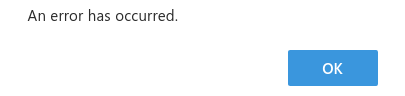

<!--Good Evening! <pause for response>-->
<!--How are we doing tonight? <pause for response>-->
<!--I only have 15 minutes here, so we're gonna go fast.-->
<!--This presentation and the presenter notes will be available at nyefan.org if you want to see it again-->
<!--The code for this presentation is available at github.com/Nyefan/Presentations-->

---
## <br />
# DEVELOPERS
### <sub><br /></sub>
<!--Developers! <short pause>-->
<!--I'm gonna make you think about operations tonight.-->
<!--Your devops engineers are gonna love me.-->
<!--<hand to ear> Sorry, it's Site Reliability now?-->
<!--<smiling, slightly slower, and with satisfaction> Platform Engineering-->
<!--How many process and operations engineers of different flavors do we have tonight, raise your hands?-->
<!--You guys already know this, you can go to sleep for the next 13 minutes and 15 seconds-->
<!--<eat the mic, lower voice conspiratorially> This talk is quarterly, so that's 53 minutes if you come to all 4-->
<!--Developers, we're gonna talk tonight about a number of action items you can take to make your platform teams' lives a hell of a lot easier and make your software more robust and reliable in the process-->
<!--Without further ado, here is...-->

---
## <br />
# DEVELOPERS
### <br />
## 10 Things I Hate About You
<!--10 Things I Hate About You.-->

---
## <br />
# DEVELOPERS
### &nbsp;&nbsp;&nbsp;&nbsp;&nbsp;<span style="color:red;">7</span>
## <span style="color:red;text-decoration:line-through"><span style="color:#455a64">10</span></span><span style="color:red;font-family:monospace;font-size:0.32em;">‸</span>Things I Hate About You
<!--Well, 7, actually - we don't have time for 10-->

---
### You don't capture and handle `SIGTERM` and `SIGKILL`
###### Kubernetes scale down process*
```rust
remove pod from the network load balancers
send SIGTERM to containers in pod
loop 30 seconds:
  if processes have exited:
    delete resources;
    exit 0;
  sleep;
send SIGKILL to containers in pod
delete resources;
exit 0;
```
###### <span style="font-size:0.5em">*simplified; see the [kubernetes pod lifecycle](https://kubernetes.io/docs/concepts/workloads/pods/pod-lifecycle/) for full details</span>

---
### You use at most once semantics
###### Example "at least once" network call scheme
```rust
function network_call(data):
  result = HttpClient.verb(data);
  if result.ok():
    return result;
  else if result.error().status_code not in [config.RETRYABLE_ERROR_CODES]:
    log.error(result.error().error_code); 
    return result.error(); // send to dead letter queue
  else:
    return retry(network_call, data)
    
```
###### <span style="font-size:0.5em">*the `network_call` should be idempotent; see [this presentation's repository](https://github.com/Nyefan/Presentations/blob/main/2023_Q3_LexTalkTech/retry.rs) for a more complete example</span>

---
### Your retries are too fast
###### Example retry scheme
```rust
function retry(network_call, data):
  retry_count = 0
  delay = config.INITIAL_DELAY_MS;
  while retry_count <= config.MAX_RETRIES:
    delay = min(
      config.MAX_DELAY_MS,
      delay * config.BACKOFF_FACTOR + rng.range(0.0..1.0) * config.JITTER_FACTOR_MS
    );
    sleep(delay);
    if (network_call(data).ok()) break;
    
```
###### <span style="font-size:0.5em">*the recursive `network_call` won't work, but slides only have 10 lines</span>

---
### You hard code default config variables
###### Example configuration variable scheme
```rust
ENV = os.environ.get("APPNAME_ENV")

function coalesce(env_var_name, config_var_path):
  return os.environ.get(env_var_name) or 
    config.read(config_var_path, f"${ENV}.yaml") or 
    config.read(config_var_path, "defaults.yaml") or 
    raise Exception()

DOWNSTREAM_SERVICE_URL = coalesce("APPNAME_DOWNSTREAM_SERVICE_URL", "appname.downstream_service.url")
RETRIES_INITIAL_DELAY_MS = coalesce("APPNAME_RETRIES_INITIAL_DELAY_MS", "appname.retries.initial_delay_ms")
RETRIES_MAX_DELAY_MS = coalesce("APPNAME_RETRIES_MAX_DELAY_MS", "appname.retries.max_delay_ms")
RETRIES_MAX_RETRIES = coalesce("APPNAME_RETRIES_MAX_RETRIES", "appname.retries.max_retries")
...

```
###### <span style="font-size:0.5em">*see the [spring boot properties hierarchy](https://docs.spring.io/spring-boot/docs/1.5.6.RELEASE/reference/html/boot-features-external-config.html) for a more complete (and arguably overengineered) list</span>

---
### Your logs don't report the source of errors
###### Rules for good logs 
```json
{
"Use log levels":
    ["TRACE", "DEBUG", "INFO", "WARN", "ERROR", "FATAL"],
"Prefer structured logging formats":
    ["json", "logfmt", "avro", "protobuf"],
"Avoid multiline logs":
    ["yaml", "formatted stack traces"],
"Include relevant program state": 
    ["ISO8601 time", "userID", "sessionID", "txnID", "flattened stack traces"]
}
```
###### <span style="font-size:0.5em">*</span>

---
### You don't speak up
###### Casual bigotry pushes marginalized groups out of the industry
```
Cisgender Women, Queer People, Neurodivergent People, Disabled People, and 
BIPOC are all underrepresented among professional software workers.

Women additionally have a huge exit rate relative to men after 5-10 years.

Casual misogyny, queerphobia, nationalism, white supremacy, and ableism are 
tolerated in this industry, especially from upper management.

A diversity of experience begets a diversity of tactics, which are required 
for delivering great software and for organizing towards a better world.
```
###### <span style="font-size:0.5em">*data pulled from the [stackoverflow developer surveys](https://insights.stackoverflow.com/survey/) and the papers examined in [this 2022 meta-analysis of the literature](https://arxiv.org/pdf/2303.05953.pdf)</span>
---
## Thank You For Your Time
&nbsp;
##### Davis St. Aubin
##### Software Engineer and Consultant
##### consulting@nyefan.org
##### https://www.nyefan.org/categories/#presentations
